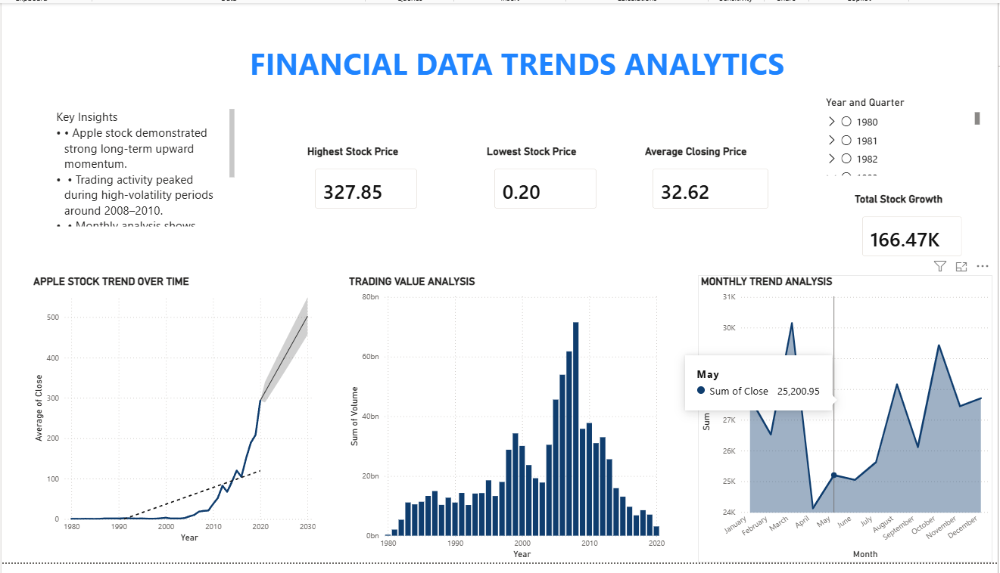

# 📈 Financial Data Trends Dashboard | Power BI

An interactive financial analytics dashboard built using **Power BI** to analyze Apple stock market performance over time. This project focuses on **time-series analysis, forecasting, KPI metrics, trading volume analysis, and monthly stock trends** to generate actionable financial insights.

---

# 🚀 Features

* 📊 Interactive Stock Price Trend Analysis
* 📈 Trading Volume Analysis
* 📅 Monthly Trend Visualization
* 🔮 Forecasting for Future Stock Prices
* 📌 KPI Cards:

  * Highest Stock Price
  * Lowest Stock Price
  * Average Closing Price
  * Total Stock Growth
* 🎛️ Dynamic Year Filters & Slicers
* 📉 Time-Series Financial Analysis Dashboard

---

# 🛠️ Tools & Technologies

* Power BI
* DAX
* Excel / CSV
* Data Visualization
* Financial Analytics
* Forecasting Models

---

# 📂 Dataset

Dataset sourced from Kaggle Apple Stock Market Dataset.

---

# 🎯 Project Goal

To analyze historical stock market data and identify:

* Long-term growth trends
* Trading activity patterns
* Monthly fluctuations
* Future stock performance predictions

using interactive business intelligence dashboards.

---

# 📷 Dashboard Preview

## Financial Data Trends Dashboard



> Replace `dashboard.png` with your actual screenshot filename.

---

# 📌 Key Insights

* Apple stock demonstrated strong long-term upward momentum.
* Trading volume peaked during high-volatility periods.
* Monthly trend analysis revealed recurring fluctuations in investor activity.
* Forecasting indicated continued positive stock performance trends.

---

# 📚 Skills Demonstrated

* Business Intelligence
* Dashboard Design
* Financial Data Analysis
* Data Cleaning & Transformation
* Time-Series Analysis
* Data Storytelling
* Interactive Reporting

---

# 📁 Project Structure

```bash
Financial-Data-Trends-Dashboard/
│
├── Dashboard.pbix
├── README.md
```

---

# 🔗 Author

## Rishit Verma

Aspiring Data Analyst & Business Intelligence Enthusiast 🚀
